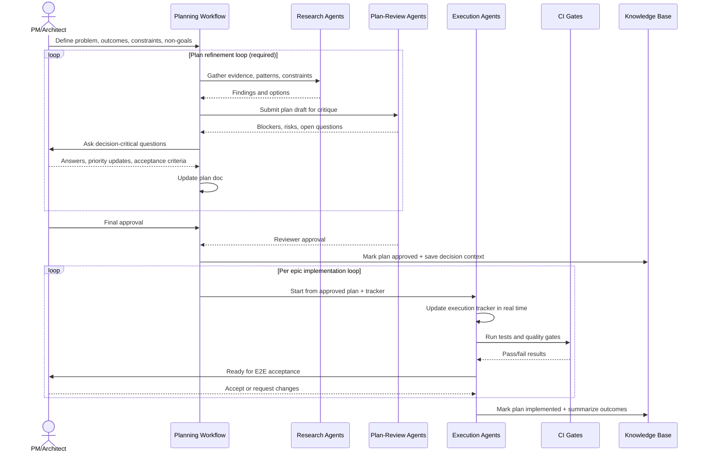
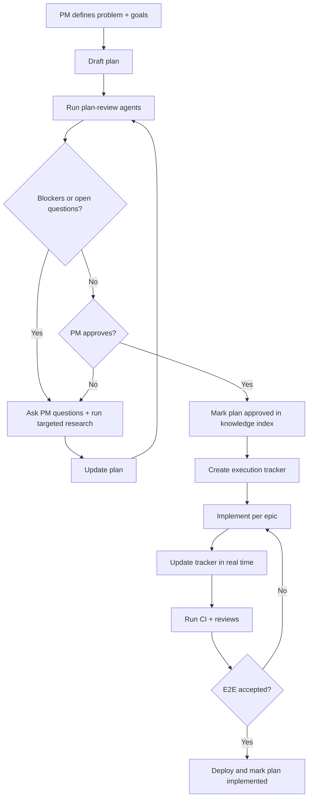

# Planning-to-Execution Sequence

## Sequence Diagram

```mermaid
sequenceDiagram
    actor PM as PM/Architect
    participant Plan as Planning Workflow
    participant Research as Research Agents
    participant Review as Plan-Review Agents
    participant Work as Execution Agents
    participant CI as CI Gates
    participant KB as Knowledge Base

    PM->>Plan: Define problem, outcomes, constraints, non-goals
    loop Plan refinement loop (required)
        Plan->>Research: Gather evidence, patterns, constraints
        Research-->>Plan: Findings and options
        Plan->>Review: Submit plan draft for critique
        Review-->>Plan: Blockers, risks, open questions
        Plan->>PM: Ask decision-critical questions
        PM-->>Plan: Answers, priority updates, acceptance criteria
        Plan->>Plan: Update plan doc
    end
    PM->>Plan: Final approval
    Review-->>Plan: Reviewer approval
    Plan->>KB: Mark plan approved + save decision context

    loop Per epic implementation loop
        Plan->>Work: Start from approved plan + tracker
        Work->>Work: Update execution tracker in real time
        Work->>CI: Run tests and quality gates
        CI-->>Work: Pass/fail results
        Work->>PM: Ready for E2E acceptance
        PM-->>Work: Accept or request changes
    end

    Work->>KB: Mark plan implemented + summarize outcomes
```

## Flowchart

```mermaid
flowchart TD
    A["PM defines problem + goals"] --> B["Draft plan"]
    B --> C["Run plan-review agents"]
    C --> D{"Blockers or open questions?"}
    D -- Yes --> E["Ask PM questions + run targeted research"]
    E --> F["Update plan"]
    F --> C
    D -- No --> G{"PM approves?"}
    G -- No --> E
    G -- Yes --> H["Mark plan approved in knowledge index"]
    H --> I["Create execution tracker"]
    I --> J["Implement per epic"]
    J --> K["Update tracker in real time"]
    K --> L["Run CI + reviews"]
    L --> M{"E2E accepted?"}
    M -- No --> J
    M -- Yes --> N["Deploy and mark plan implemented"]
```

